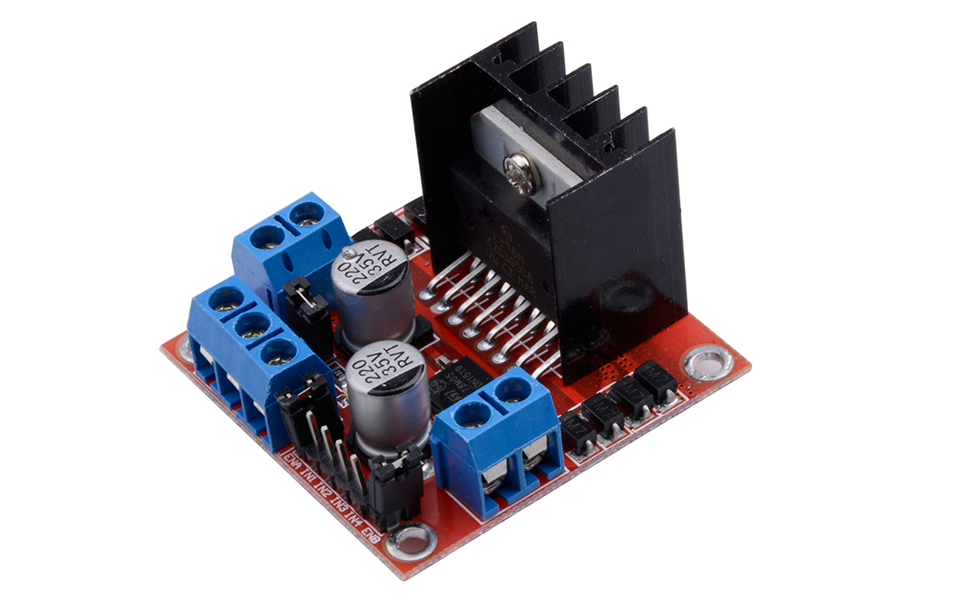

## Team 32: Independently Controlled Irrigation System for Agriculture Plots

### September 17, 2024
**Initial Meeting with TA Surya**

Today, we had our first meeting with TA Surya to establish a plan for the semester. The discussion focused on how to break down the project into smaller, manageable milestones while ensuring all critical components are addressed. We also reviewed the importance of having a clear schedule to manage dependencies between hardware and software components. This meeting helped solidify our timeline and next steps.

### October 3, 2024
**Revamped Design Document**

During today’s meeting, we revamped the design document to clarify system requirements and refine the overall project scope. Key changes included defining high-level requirements such as accurate soil moisture detection and efficient Bluetooth communication. We also created updated diagrams to reflect the revised design, including the state machine for the control subsystem and the flowchart for Bluetooth data hopping.

This session was critical for aligning team members on the project’s goals and ensuring all necessary components were accounted for.

### October 10, 2024
**Sensor Integration Planning**

We discussed the integration of soil moisture, temperature, and humidity sensors with the ESP32 microcontroller. This session focused on identifying the pin mappings, power requirements, and timing considerations for sensor communication. Proposed test setups were outlined to confirm the sensors' accuracy and responsiveness in real-world conditions.

### October 23, 2024
**Initial PCB Design**

Today marked a significant milestone as we completed the initial PCB design and determined the parts we needed to order. The design includes connections for the ESP32, voltage regulators, and sensor inputs. We discussed trade-offs in component selection, particularly around cost versus performance. After reviewing the design, we submitted a parts order to ensure availability for the next stages of the project. We also settled on the L298N motor driver.

### October 30, 2024
**Preliminary Code Testing**

We began testing initial BLE communication between two ESP32 devices. This involved using predefined UUIDs for sending and receiving data. Challenges included intermittent signal drops, which we hypothesized were due to environmental interference. Next steps involve adding error handling and retry mechanisms to the code.

### November 5, 2024
**First BLE Testing**

The first BLE data forwarding test between the sensing node and the irrigation system was conducted today. Both nodes successfully connected, and data packets were transferred reliably over short distances. The test setup included two ESP32s powered by USB and spaced 2 meters apart. We noted that the BLE notification feature worked as expected, but additional range testing is needed.

### November 12, 2024
**Adjusted PCB Design**

We identified an oversight in our initial PCB design—there was no dedicated programmer circuit for the ESP32. This required a major update to the design to include a complete programmer interface, which delayed progress slightly but ensured functionality for later stages. During this session, we updated the schematics and re-routed several traces to accommodate the new circuit. This adjustment was crucial for simplifying firmware updates and debugging in future iterations.

### November 14, 2024
**Second BLE Testing**

We conducted additional BLE testing today, focusing on extended range and robustness. The nodes were placed 10 meters apart, with two obstacles in between to simulate real-world conditions. Signal strength was weaker, and 5% of data packets were lost. Error handling mechanisms, including retries, successfully recovered most of the dropped packets.

### November 19, 2024
**Integration of Sensing and Irrigation Subsystems**

Progress was made in integrating the sensing and irrigation subsystems. BLE communication between nodes was tested alongside real sensor data, allowing the irrigation system to adjust valves based on sensor readings. Debugging focused on timing issues and ensuring data was correctly assigned to the relevant node. We are currently still struggling with opening and closing the valves.

### December 1, 2024
**Integration of Sensing and Irrigation Subsystems**

Our water valve broke, we decided to pivot the way our demo performed. Instead, we decided to use gravity as a way to simulate the water flow. However, we noticed that the water flow was about 75% less than the valve, so our watering time will proportionally increase.

