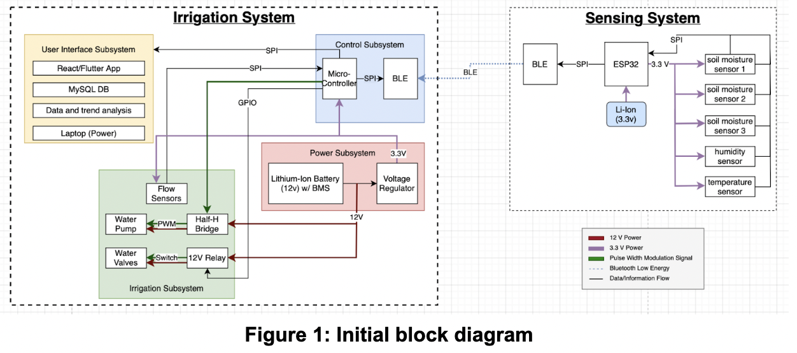
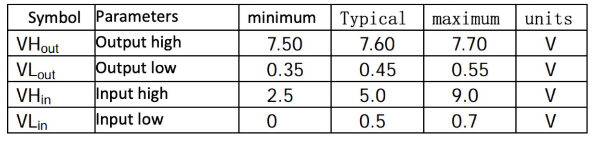
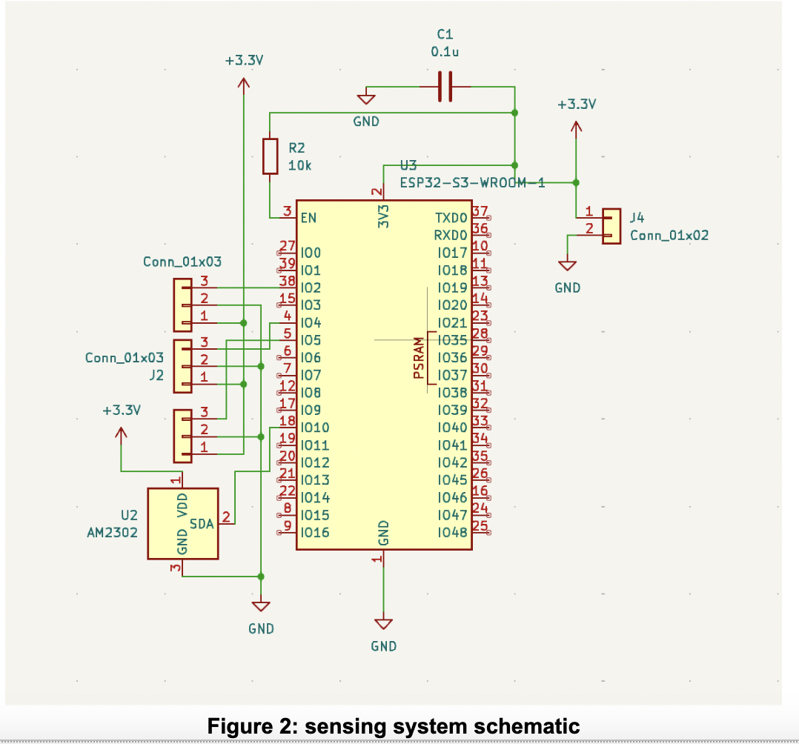
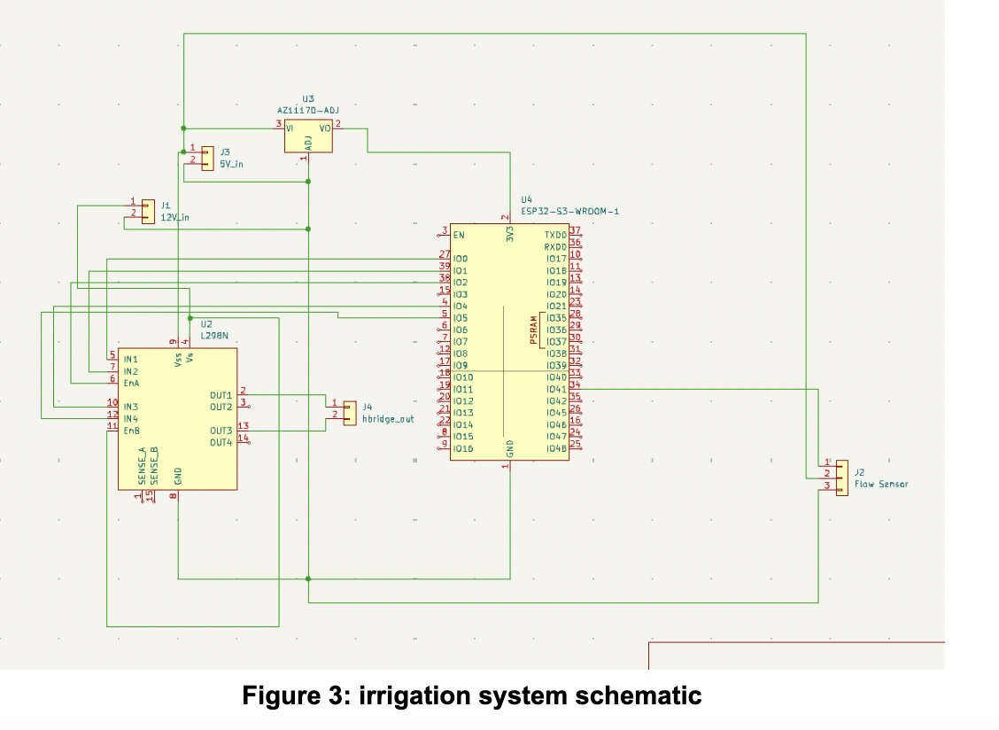
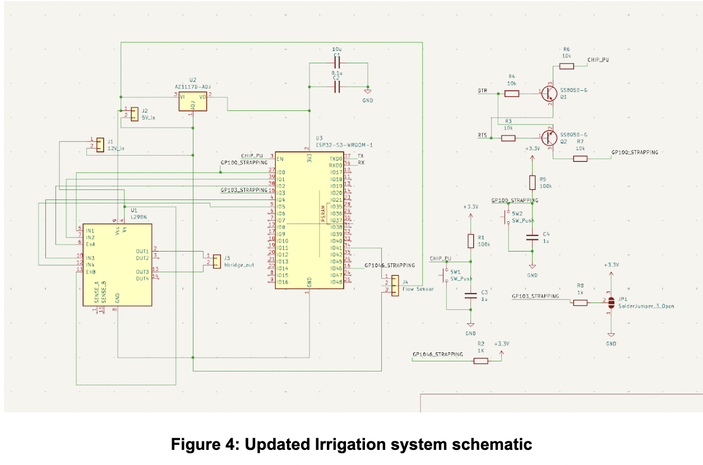
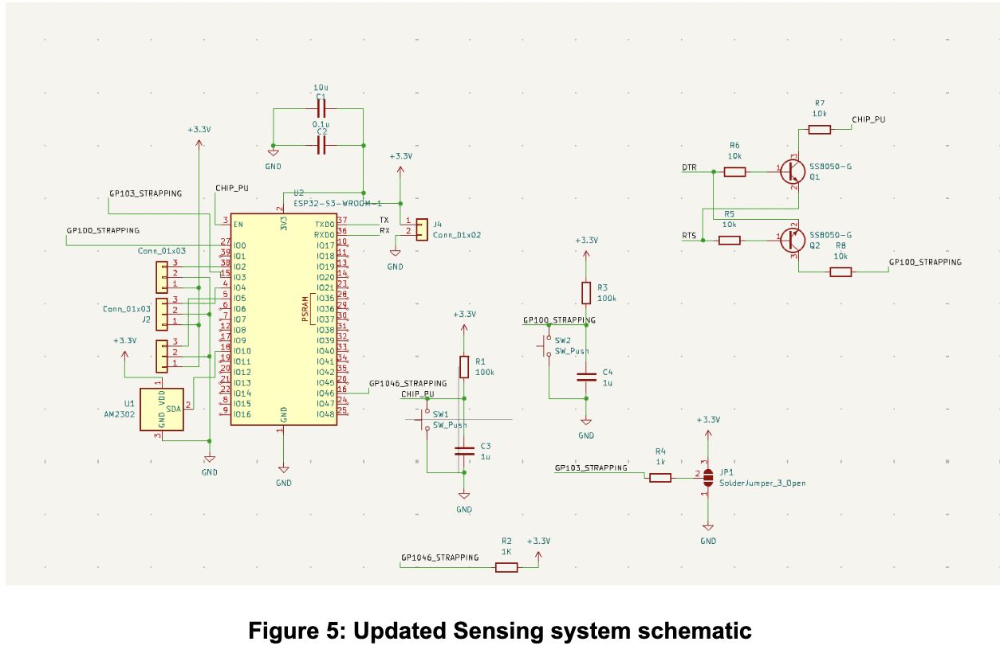
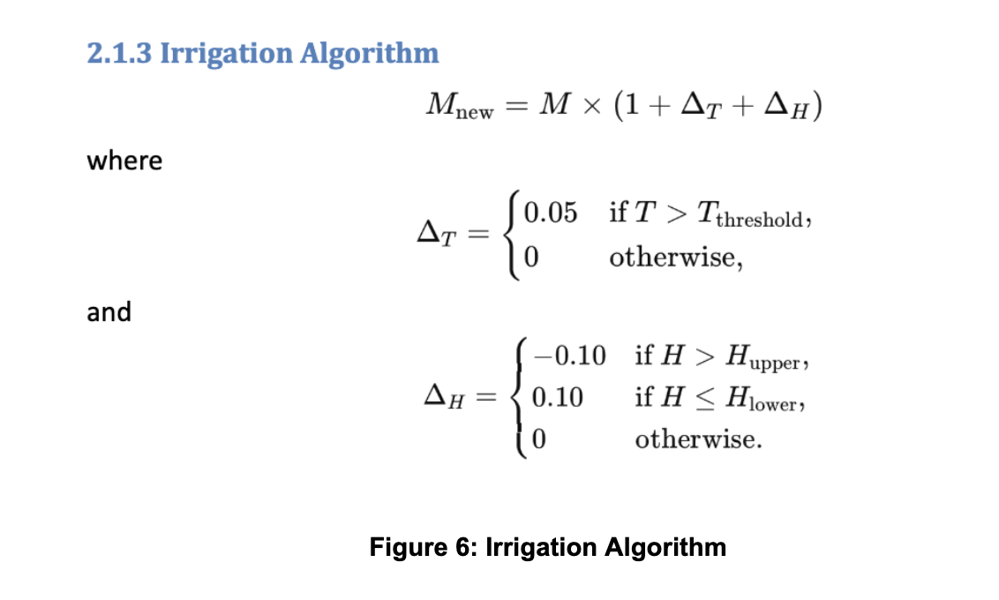
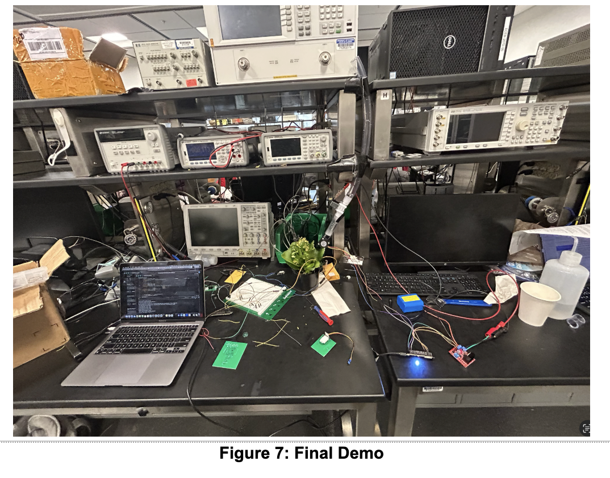

September 17th, 2024
First meeting with our TA
We had a productive meeting with our TA, Surya, to discuss the project outline and establish the main goals we aim to accomplish. During the discussion, we assessed the feasibility of the project, taking into account both time and budget constraints, to ensure its successful completion. We also collaborated on developing a high-level timeline, which outlines the key milestones and deadlines for the project. Additionally, we reviewed the immediate next steps, which include refining the project requirements, allocating responsibilities among team members, and preparing for the upcoming design phase. This meeting provided valuable clarity and direction for the project moving forward.

September 19th, 2024
Project Proposal
I met with the team to discuss the proposal requirements and collaboratively worked on the block diagram. During the meeting, we established the high-level requirements for the project and outlined detailed specifications for each subsystem within both the irrigation and sensing systems. This helped provide a clear structure for project development.

October 1st, 2024
Weekly meeting with TA
We had our weekly team meeting with our TA, Surya, to discuss various aspects of our project progress. During the meeting, we reviewed the feedback on our proposal to identify areas where we lost points and to better understand how we can address those issues moving forward. We also discussed the structure and expectations for the design document, ensuring that we have a clear plan for its development. Additionally, Surya provided insights into how the design review will be conducted, including the evaluation criteria and key elements to focus on.

October 3rd, 2024
Design Document
We collaborated on the design document, while focusing on the technical details of the sensing system. I outlined the system's requirements and verification criteria to ensure its functionality and reliability. Additionally, we conducted a thorough tolerance analysis to account for potential variations and ensure that appropriate precautions were in place to maintain system performance under different conditions.

Tolerance analysis 
The power system needs to be carefully designed to ensure stable voltages for all the subsystems. The power subsystem contains a 12V battery but since our PCB requires a 3.3 V we need to use the LD1117 voltage regulator. 
Since: Vin > Vout + Vdropout
Vdropout = 1V (LD1117 datasheet)
Vout= 3.3V
Vin = 12V
Since Vin is greater than 4.3 V but lesser than 15V, we ensure that the output voltage will be 3.3V 

The AQT15S solenoid valve operates at 12V with a 15% voltage range which means it can operate between 10.2V - 13.8V. 
The valve will be connected to the microcontroller which operates at 3.3V but will need an Hbridge. Below is a table from the L9110 H bridge

On analyzing the table we can calculate the internal resistance.
Vcc = 9V
Iout = 750mA
Output high voltage VHout = 7.6V (typical)
Vdrop = Vcc - VHout = 9V -7.6V = 1.4V
Using Ohm’s Law: Rinternal=IoutVdrop​​
Rinternal = 1.87

The Hbridge outputs about 750mA ~ 800mA 
The maximum voltage drop will be Vdrop=IR (Ohm’s Law): 800mA *1.87  = 1.496V
Vsolenoid= 12V-1.496V =10.504V which is more than 10.2V which will allow the solenoid to work as expected

October 22nd, 2024
PCB designs
We completed the initial PCB design for both the sensing and irrigation systems. After finalizing the designs, we placed orders for the required components for both systems. During the process, we carefully evaluated various design options and made trade-offs to identify the most effective and efficient design that aligns with our project requirements.

November 5th, 2024
Initial BLE testing
Using the provided development kits, we tested the BLE functionality to transmit sample data between two ESP32 devices. As part of the testing, we experimented with varying distances between the two devices to evaluate the range of BLE communication. The tests demonstrated that BLE worked successfully within a range of 2 meters, providing valuable insights into its operational limitations and suitability for our project.

November 10th, 2024
Updated PCB Schematic
We soldered the sensing PCB but discovered that the programming circuit was missing, which prevented us from programming the ESP32. On realising this, we used the class wiki for the programming circuit design. Placed a new order for updated PCBs that include the necessary programming circuit to address this issue.

November 15th, 2024
Sensor unit testing
We conducted unit tests on the sensors in the sensing system. Using the development kits, we connected the capacitive soil moisture sensors as well as the temperature and humidity sensors to the ESP32-S3 and successfully retrieved readings from each. To evaluate the soil moisture sensor, we tested it with different soil samples to observe varying readings. For the temperature and humidity sensor, we experimented by warming it through friction to generate different readings. These tests helped validate the functionality and responsiveness of the sensors under varying conditions.

November 19th, 2024
Integrated BLE between Sensing and Irrigation system
After receiving data from the sensors in the sensing system, we transmitted it as a single string to the irrigation system. The irrigation system then parsed the string and displayed the readings on the serial monitor. This process allowed us to verify that the data was being transmitted accurately and correctly interpreted by the irrigation system.
November 20th, 2024
Mock Demo
We conducted a mock demo of our project for our TA, showcasing the progress made so far. During the demonstration, we verified that sensor data was successfully transmitted to the ESP32 of the irrigation system every 5 seconds, as specified in the high-level requirements outlined in our project proposal. This helped demonstrate the functionality and reliability of our current system implementation.
November 22nd, 2024
Unit testing solenoid valve
Unit tested the solenoid valve to be controlled using the ESP32 with the L298N motor driver. Using basic testing code in Arduino, we opened and closed the valve accordingly. We were having an issue earlier with the valve not functioning properly but on debugging realised we needed to use thicker wires instead. 
November 30th, 2024
Testing entire project
We integrated the irrigation and sensing systems using the algorithm we developed. Based on the sensor readings, the solenoid valve automatically opened and closed as expected. However, we encountered a challenge with programming the new PCBs, as the ECE Supply Center did not have all the necessary components for the programming circuit.

December 4th, 2024
Final Demo
Final demo with the TA and professor and were able to successfully show all the high level requirements we initially set out for our project. 

